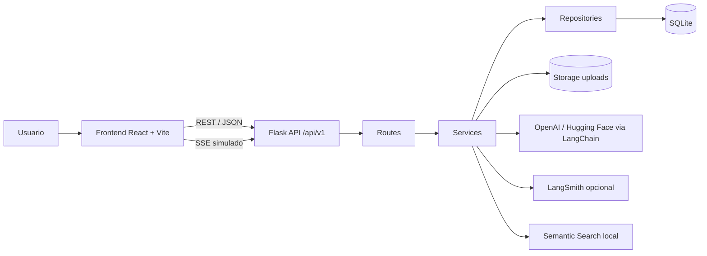
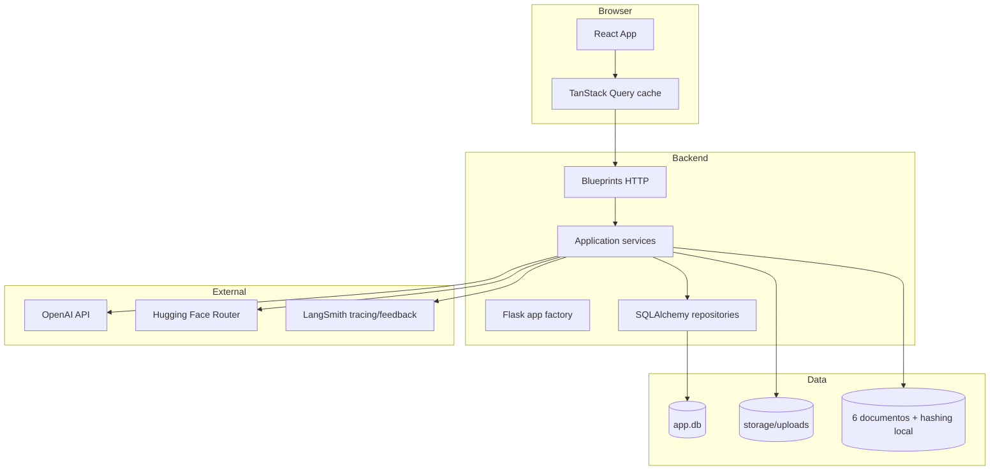
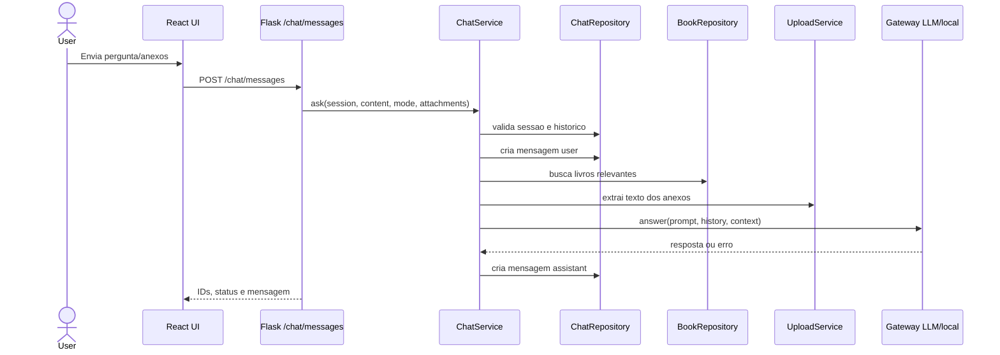
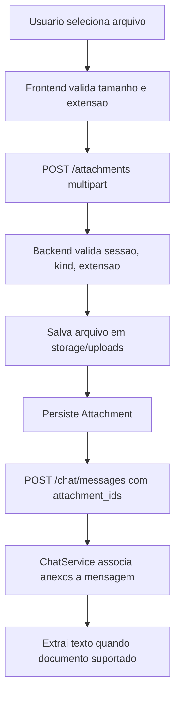
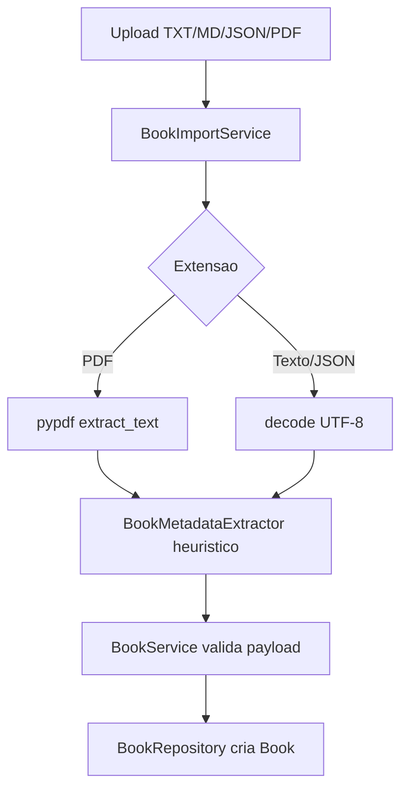
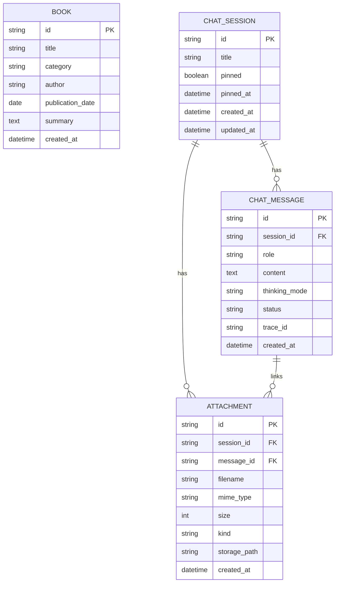

# Arquitetura do sistema

## Visao geral

MindSight AI segue uma arquitetura fullstack simples, adequada para MVP:

- Frontend React/Vite consome API REST e renderiza chat/biblioteca.
- Backend Flask expoe endpoints versionados em `/api/v1`.
- Servicos de aplicacao concentram regras de chat, livros, uploads e busca.
- SQLAlchemy persiste sessoes, mensagens, livros e anexos em SQLite.
- Gateways opcionais integram OpenAI, Hugging Face e LangSmith.

## Containers

## Camadas backend

| Camada | Arquivos | Responsabilidade |
| --- | --- | --- |
| App factory | `backend/app/__init__.py` | Criar Flask app, registrar blueprints, inicializar extensoes e handlers. |
| Rotas | `backend/app/routes/*.py` | Traduzir HTTP em chamadas de servico e respostas JSON. |
| Servicos | `backend/app/services/*.py` | Regras de negocio, gateways, upload, importacao e busca. |
| Repositorios | `backend/app/repositories.py` | Persistencia SQLAlchemy e queries. |
| Modelos | `backend/app/models.py` | Entidades `Book`, `ChatSession`, `ChatMessage`, `Attachment`. |
| Config | `backend/app/config.py`, `env_loader.py` | Variaveis de ambiente, paths e configuracoes por ambiente. |

## Fluxo de chat

Observacao: o endpoint SSE atual nao transmite tokens reais do provedor; ele faz split da mensagem persistida e emite tokens simulados.

## Fluxo de upload/anexos

Risco atual: upload e envio de mensagem nao sao uma unica transacao. O cliente remove uploads remotos em falhas conhecidas e restaura os arquivos locais para retry; o backend tambem impede reutilizar um anexo ja vinculado. Um crash/abandono ainda pode deixar orfao, pois nao ha job de backstop.

## Fluxo de importacao de livro

## Modelo de dados

## Frontend

| Area | Arquivos | Responsabilidade |
| --- | --- | --- |
| Raiz de composicao | `frontend/src/App.tsx` | Coordena queries/mutacoes, selecao de view e composicao das features. |
| API client | `frontend/src/shared/api/client.ts` | Chamadas REST e tratamento basico de erro. |
| Credencial runtime | `frontend/src/shared/api/credentials.ts` | Mantem a API key apenas na sessao do navegador. |
| Tipos | `frontend/src/shared/api/types.ts` | Contratos TypeScript usados pela UI. |
| Chat | `frontend/src/features/chat/*` | Sidebar, header, conversa, composer, Markdown, anexos, audio e gestos. |
| Livros | `frontend/src/features/books/*` | Administracao, importacao, filtros e cards. |
| Configuracoes | `frontend/src/features/settings/*` | Tema, modelos, thinking mode e credencial de sessao. |
| UI base | `frontend/src/components/ui/*` | Botao, textarea e badge. |
| Estilo | `frontend/src/app/styles/globals.css` | Tokens Tailwind, temas e estilos Markdown. |

O primeiro corte reduziu `App.tsx` de cerca de 1.550 para 462 linhas fisicas. O proximo corte, se a complexidade crescer, e extrair hooks controladores para sessoes, envio de mensagens e anexos; componentes visuais de chat, livros e configuracoes ja estao separados.
