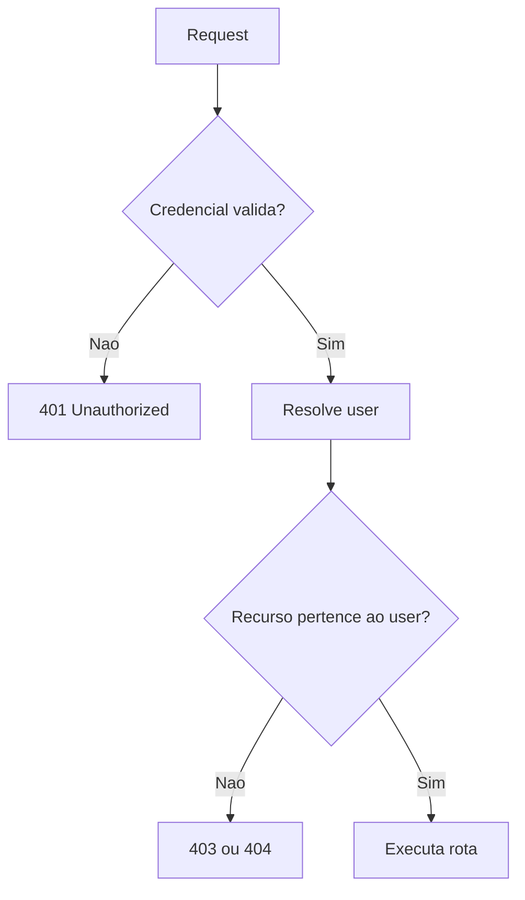
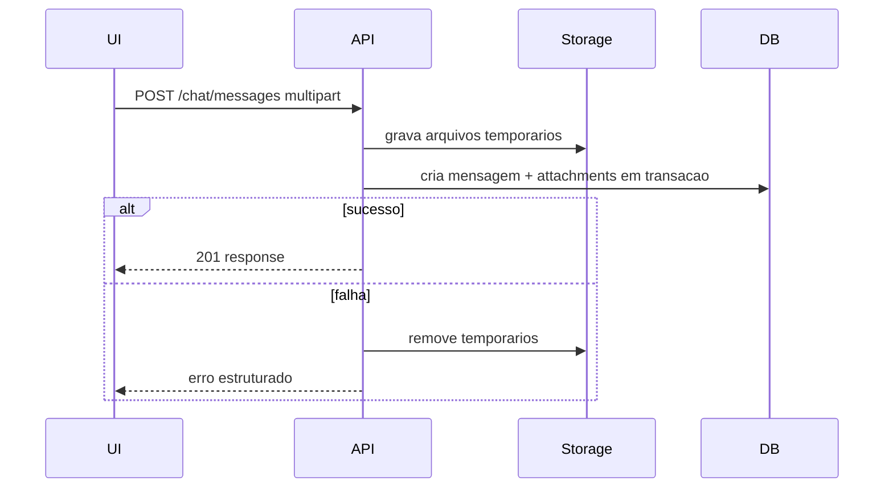

# Roadmap de melhorias

Este roadmap prioriza reducao de risco antes de features novas.

Atualizado em 2026-07-24: o segredo compartilhado fecha a exposicao anonima do MVP single-tenant controlado, mas nao deve ser confundido com autenticacao/autorizacao de usuario. Ownership volta a ser P0 se o produto for publicado para clientes distintos.

## P0 - Fechar riscos de exposicao

| Item | Resultado esperado | Criterio de aceite | Status |
| --- | --- | --- | --- |
| Usar WSGI em producao | Container de producao nao usa servidor dev Flask. | Dockerfile/compose de producao usam WSGI. | Concluido — Gunicorn com `--preload`/`post_fork`, verificado via build+run real. |
| Validar config de producao | Startup falha com secrets/placeholders inseguros. | Teste cobre `APP_ENV=production` com `SECRET_KEY` invalida. | Concluido — cobre `SECRET_KEY` e `API_KEY`. |
| Autenticacao minima | API deixa de ser publica para dados sensiveis. | Endpoints de chat/anexos/livros exigem credencial. | Concluido — segredo compartilhado via `API_KEY`/`Authorization: Bearer`. |
| Ownership | Usuario so acessa seus dados. | Testes provam 403/404 para recurso de outro usuario. | Condicional: fora do MVP single-tenant; obrigatorio antes de qualquer deploy publico/multiusuario. |

Fluxo alvo de autorizacao:

## P1 - Contrato, dados e operacao

| Item | Resultado esperado | Criterio de aceite | Status |
| --- | --- | --- | --- |
| Alembic/Flask-Migrate | Schema versionado. | CI aplica migrations em banco limpo. | Concluido. |
| Manter enum de status alinhado | Backend, OpenAPI e TS usam `failed`. | Teste de contrato cobre o valor `failed`. | Concluido. |
| Paginacao | Listagens previsiveis. | Endpoints aceitam `limit` e cursor/page com maximo. | Concluido. |
| Hardening de uploads/PDF | Arquivo disfarçado ou excessivo não chega ao storage definitivo/parser sem limites. | Testes cobrem assinatura, MIME, streaming limitado, quarentena, rollback, páginas, streams, texto e deadline. | Concluido para o MVP — AV/CDR e processo isolado ficam condicionais a exposição pública. |
| Contrato frontend gerado | OpenAPI e TypeScript não divergem silenciosamente. | Artefato e tipos são reproduzíveis; CI falha em drift. | Concluido — `export_openapi.py`, `openapi-typescript`, `api:check`. |
| Smoke full-stack | Quebras entre browser, proxy, Flask e banco são detectadas. | Jornada real persiste chat e livro sem interceptação de API. | Concluido — workflow `ci-fullstack.yml`. |
| Cleanup de uploads orfaos | Rotina remove anexos que falharam antes de vincular mensagem. | Job/endpoint interno testado com arquivos orfaos. | Concluido — CLI idempotente por idade remove rows não vinculadas, quarentenas e arquivos gerados sem referência; possui dry-run, proteção de path e testes de falha. |
| Transacao de anexos | Envio com anexos nao deixa orfaos. | Falha de `sendMessage` aciona compensacao ou endpoint unico. | Concluido — o frontend usa um único `POST /chat/messages` multipart; staging, vínculo e mensagens compartilham o commit, com rollback/compensação física. |

Fluxo alvo para mensagem com anexos:

## P2 - Confiabilidade de IA e observabilidade

| Item | Resultado esperado | Criterio de aceite | Status |
| --- | --- | --- | --- |
| Timeout do gateway | Requests nao ficam presos. | Teste simula provider lento e retorna erro controlado. | Concluido — `CHAT_GATEWAY_TIMEOUT_SECONDS` (default 30s) passado ao `ChatOpenAI`. |
| Rate limit | Protecao de custo e abuso. | Limite por usuario/IP com resposta 429. | Concluido — flask-limiter, 20/min por IP em `/chat/messages` (default global 200/min). Limitacao conhecida: contador em memoria por processo, nao exato sob multiplos workers do Gunicorn sem Redis. |
| Streaming real | UI recebe tokens do provedor quando suportado. | E2E ou teste de contrato valida SSE real. | Aberto — a rota SSE ainda reproduz uma mensagem ja persistida, nao `stream=True` do provedor. |
| Logs estruturados | Requests correlacionaveis. | Evento de conclusao contem request_id, method, path, status e duration_ms. | Concluido — IDs externos sao validados, logs filhos recebem o filtro e cada request emite `request_completed` com duracao. Logs de dominio continuam livres para campos proprios. |
| Metricas | Operacao basica mensuravel. | Expor endpoint/collector para latencia, erros e chamadas LLM. | Concluido — `/metrics` Prometheus cobre requests/status/latência e chamadas/duração do gateway, com labels limitadas e agregação multiprocess no Gunicorn. |

## P3 - Evolucao de produto e DX

| Item | Resultado esperado | Criterio de aceite | Status |
| --- | --- | --- | --- |
| Refatorar `App.tsx` | Codigo modular e testavel. | Views/componentes extraidos; coverage inclui logica movida. | Concluido (primeira etapa) — aproximadamente 1.550 -> 462 linhas fisicas, com features de chat/livros/configuracoes extraidas e testadas. Hooks controladores sao uma evolucao, nao um bloqueio atual. |
| Drawer acessivel | Navegacao mobile inclusiva. | Focus trap, Escape, `role=dialog`, testes de acessibilidade. | Concluido — `useDialogAccessibility` (hook proprio, testado). |
| Alternativa ao swipe | Pin/delete por teclado. | Botoes/menu contextual com teste. | Concluido (Fase 1). |
| Busca real de chats | Botao existente passa a funcionar. | Filtro por titulo/conteudo com testes. | Concluido — filtro por titulo; conteudo das mensagens fica para uma iteracao futura se houver demanda. |
| Busca vetorial real | FAISS/embeddings opcionais funcionam. | Teste opcional com dependencia AI instalada. | Aberto. |
| Localizacao PT-BR | Labels consistentes. | Datas relativas usam `Intl.RelativeTimeFormat('pt-BR')`. | Concluido — datas, grupos temporais e metadados HTML em PT-BR. |
| Cleanup de dependencias mortas | `package.json` reflete o que o codigo realmente usa. | Dependencias e utilitarios sem consumidores removidos. | Concluido — removidos `@tanstack/react-router`, `zod`, `class-variance-authority`, `@storybook/test`, `happy-dom`, `generateId` e `truncate`. |
| Cleanup do microfone no unmount | `useAudioRecorder` nao deixa o microfone ligado. | Effect de cleanup testado com desmontagem durante gravacao. | Concluido. |

## Sequencia recomendada

1. P0 inteiro antes de qualquer deploy publico.
2. P1 antes de aumentar volume de usuarios/dados.
3. P2 antes de usar provedores LLM em producao com custo real.
4. P3 em paralelo com evolucao de UX, desde que P0 esteja fechado.

## Definition of done para fixes

Todo fix relevante deve incluir:

- Teste automatizado no nivel mais proximo do risco.
- Atualizacao de OpenAPI/tipos quando payload mudar.
- Atualizacao de docs quando comando, env ou comportamento mudar.
- Criterio de rollback quando envolver dados ou migracao.
